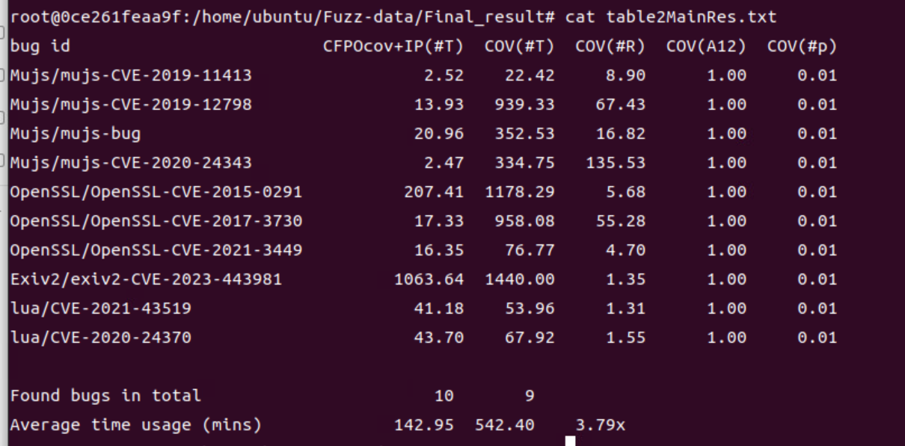
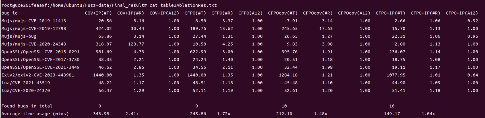
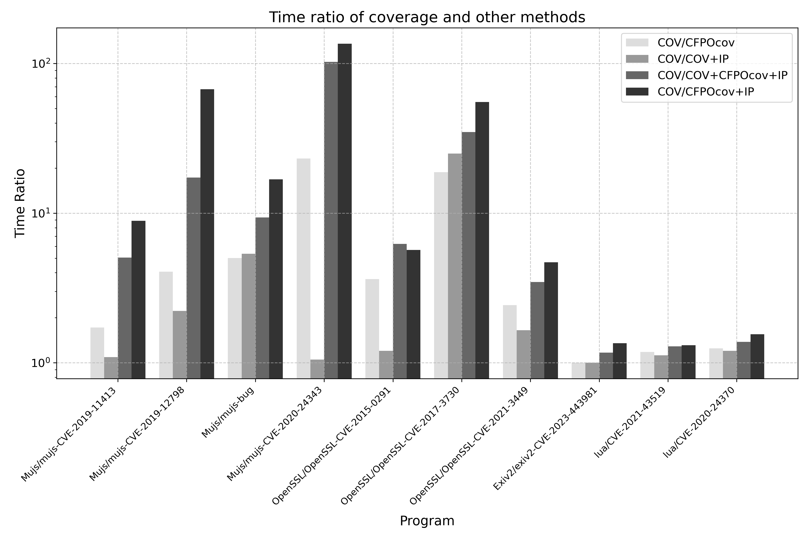

# CFPOFuzz
## Artifact description
This is the artifact of (**Context-Free Property Oriented Fuzzing**) in ICSE 2026. 

The artifact is provided as a docker image, which contains the prototype of the proposed method and benchmarks used for evaluation. The aim is to assist the reviewers in reproducing the experimental results in our evaluation.

## Prerequisites
+ Hardware: ~3.1 GHz CPU (all experiments were performed on a server with Intel(R) Xeon(R) Gold 6458Q CPU @ 3.10GHz, 128 Cores, 256GB), 500+GB free disk space.
+ Unix / Linux OS: We have validated the artifact on Ubuntu system
+ [Docker](https://www.docker.com/pricing/)

## Running the artifact
We assume that the following commands are run in sudo mode. 

Firstly, pull the already prebuilt docker image from [docker hub](https://hub.docker.com/r/icse26cfpofuzz/cfpofuzz). Please make sure its name is `icse26cfpofuzz/cfpofuzz`.
```sh
$ docker pull icse26cfpofuzz/cfpofuzz:latest
```

If everything is ok, a `icse26cfpofuzz/cfpofuzz` image should be found in the images listed by `docker images` command. Then, you can create a container of such image and start a Bash session using the following command. An interactive `bash` shell on the container is also executed at the moment.
```sh
$ docker run  --privileged -it icse26cfpofuzz/cfpofuzz:latest
```

If all goes well, the container should be running successfully. Otherwise, you can seek help from [Docker Doc](https://docs.docker.com/) if needed. 

Now, navigate into the directory containing our experimental environment and list the contents. 
```sh
$ cd /home/ubuntu/ && ls
CFPOfuzz /  CFPOfuzz-Benchmark / Fuzzdata / LLVM / Newbug / demo /

$ cd /home/ubuntu/CFPOfuzz && ls
AFL-cfpo /  antlr  /  ccmop  /  rv-monitor /  wcompiler / AFLnet-cfpo / aspectc / examples / wac-pass

$ cd /home/ubuntu/CFPOfuzz-Benchmark && ls
Exiv2 / Mujs / OpenSSL / TinyDTLS / lua  / run.py

$ cd /home/ubuntu/Fuzzdata && ls
Data_collection.py / data / gen_result.sh / table_processor.py / get_tablefig_latex.py

$ cd /home/ubuntu/Newbug && ls
Live555-0.92-LV3 / Newcrash_input   /    luna-0.1.1-LN1 / luna-0.1.1-LN3
Live555-0.92-LV4 / TinyDTLS-0.9rcl-TD4 / luna-0.1.1-LN2 / mujs-1.0.9-MJ5
```
The necessary items to reproduce our evaluation are listed, including benchmark programs and scripts. The rest of this README assumes you are working in `/home/ubuntu`.
## Run the example for Motivition
In the example discussed in our paper, we utilized a simple C++ program to demonstrate the superiority of our approach. In most cases, our method is able to identify the target input that triggers the bug Around ***30 seconds***, whereas the coverage-guided (COV) approach struggles to find the target input within ***10 minutes***. ***Please note that we also use the monitor-instrumented version of the program for coverage-oriented fuzzing（COV）***。Next, we will use this simple demo to familiarize ourselves with our methodology and tools.
```
$ cd /home/ubuntu/demo
$ ls
in   / stack.mop   /  test.cpp
```
The content of ```stack.mop``` is as follows:
```
Stack() {
	event push after() :
              call(%push(...)){}
    event pop after() :
              call(% pop(...)){}
   cfg :
        S -> push S pop | S S |push S| epsilon
    @fail
    {
        printf("Stack hava errs !");
    }
}
```
In this context, ```event``` refers to events related to program behavior. Here, two events are defined: ```push ```and``` pop```. The ```cfg``` describes a property based on a context-free grammar, where ```fail``` indicates that a bug will be triggered if the program behavior violates the property, and ```match``` indicates that a bug will be triggered if the program behavior satisfies the property. Since our Motivition example only uses a single stack structure, there is no need to distinguish between different stacks. However, if multiple distinct stacks appear in the program, we can use a parameterized MOP file, where different stack base addresses are used as parameters for identification and differentiation. An example is as follows:
```
Stackp(std::stack<int> key) {
     event push after(std::stack<int> key): call(% stack<int>.push(...))&& target(key){}
     event pop after(std::stack<int> key): call(% stack<int>.pop(...))&& target(key){}
     cfg :
        S -> push S pop | S S | push S | epsilon
    @fail
    {
        printf("Stack hava errs at %p!",key);
        __RESET;
    }
}
```


Next, based on the MOP file, we perform the instrumentation and compilation of the program. Our instrumentation process is divided into three parts: ***event instrumentation***, ***related control condition instrumentation*** (associated with events), and AFL's original ***coverage instrumentation***. You can complete the entire instrumentation and compilation process by running the following command in the current directory (```/home/ubuntu/demo```):
```
$ wac -mop stack.mop -np -afl  -cxx test.cpp -o test -print
```

After the instrumentation and compilation are completed, a directory called ```stackaspect``` will be generated in the current directory. This directory contains relevant control flow dominator information, the generated runtime libraries, and other related data. Therefore, if you want to use our method for testing, you must include the path to this directory as a parameter. You can run the following command to perform the fuzzing test:
```
$ echo core >/proc/sys/kernel/core_pattern
$ /home/ubuntu/CFPOfuzz/AFL-cfpo/afl-fuzz -c 1 -r ./stackaspect -i in -o out-cfpo ./test
```
The``` -c ```parameter is followed by different configuration modes, which is an integer between 1 and 7(***1: CFPO*+IP; 2: CFPO*+IP+COV; 3: CFPO*; 4: CFPO*+COV; 5: COV+IP; 6: CFPO+IP; 7: CFPO***)，The value 1 indicates the use of the target method proposed in this paper.

For property matching, distance calculation, and other related information, we use*** shared memory***  for communication. Determining ***whether the defined receiving state*** has been reached is done solely through the information in shared memory. Therefore, in coverage-guided fuzzing, the information in the stackaspect directory is not needed. The fuzzing command is as follows:
```
$ /home/ubuntu/CFPOfuzz/AFL-cfpo/afl-fuzz  -i in -o out-cov ./test
```

The initial input is stored in``` /home/ubuntu/demo/in/input```, and its content is ```"hhhhhh"```.You will observe that our method will identify the ```target input``` that triggers the bug  within ```1 minute```, and it will be saved in ```/home/ubuntu/demo/out-cfpo/RVC```. In contrast, coverage-guided fuzzing is unlikely to discover the target input within``` 10 minutes```.
## Reproducing experimental results
In our experiments, there are a total of 17 tasks. Among them, 10 tasks (from the `CFPOfuzz-Benchmark`) were evaluated under eight configurations (CFPO*+IP, CFPO+IP, CFPO*, CFPO, COV, COV+IP, COV+CFPO*, COV+IP+CFPO*). Our target approach is CFPO*+IP. Since it requires running 80 tasks in parallel, we provide scripts to automate and execute all experiments. The remaining 7 tasks(from the `New-bug`) involve previously unknown zero-day bugs discovered in real-world programs, which you can reproduce individually using our method as described in this section.

Given the long runtime of the evaluation and the large number of parallel tasks, all of our experiments were conducted on a server with 128 CPU cores and 256GB of memory.

### Reproduce the experimental results of existing bugs:
```bash
$ cd /home/ubuntu/CFPOfuzz-benchmark
$ echo core >/proc/sys/kernel/core_pattern
# python3 run.py  execute time   test rounds
$ python3 run.py  24  5
# wait......
```


All tasks will be repeated 5 times, requiring approximately **9600 core-hours**. If you run one CPU core for one hour, that is one core-hour. 

After the fuzzing is completed, The time to discover the first target input is redirected to the output at `/home/ubuntu/Fuzz-data/data.`The directory structure of Fuzz-data is roughly as follows.
```
├── data
│   ├── num1
│   │   ├── exiv2
│   │   │   └── exiv2-CVE-2023-44398
│   │   │       ├── out1
│   │   │       ├── out2
│   │   │       ├── out3
│   │   │       ├── out4
│   │   │       ├── out5
│   │   │       ├── out6
│   │   │       ├── out7
│   │   │       └── out8
│   │   ├── Mujs
│   │   │   ├── mujs-CVE-2019-11413
│   │   │   └── mujs-CVE-2019-12798
|   |   |   .......
|   ├── num2
|   ├── num3
|   ├── num4
|   ├── num5
|——Data_collection.py
|——get_tablefig_latex.py
|——table_processor.py
|——gen_result.sh
```
In this context, num**x** represents the results of the **x-th** experiment. The subdirectories under num correspond to different programs, and within each program directory, specific task names (including CVE identifiers) are located. As mentioned earlier, we conducted experimental evaluations using eight different configurations for each task. Therefore, each task contains eight out directories, each with a distinct identifier. These identifiers represent different configurations, recording the time taken to discover the first target input for the same task under different configurations(out1:CFPO*+IP; out2：CFPO*+IP+COV; out3:CFPO*; out4:CFPO*+COV; out5:COV+IP; out6:CFPO+IP; out7:CFPO; out8:COV) 
After completing five rounds of experiments, you can collect, organize, and compute the experimental data using the following command. Data from each round will be collected in the **Single_wheel** directory,The final results will be presented in the **Final_result** directory. This directory contains all experimental results from the five rounds of experiments for all eight configurations with known defects, as well as the generated results of Tables 2, 3, and Figure 6 in the paper.

```
$ cd /home/ubuntu/Fuzz-data
$ bash gen_result.sh
```
Executing **gen_result.sh** is equivalent to executing the commands **python3 Data_collection.py** , **python3 get_tablefig_latex.py**, and **python3 table_processor.py** in sequence, which collects, calculates, analyzes, and generates the final result from the data.

After generation, we can use the following commands to view the results.
```
$ cd /home/ubuntu/Fuzz-data/Final_result
$ ls
figure6Plot.png / figure6Plot.txt / table2MainRes.tex / table2MainRes.txt / table3AblationRes.tex / table3AblationRes.txt
```
The files **table2MainRes.txt** , **table3AblationRes.txt** ,  **figure6Plot.png** , and **figure6Plot.txt** correspond to Table 2, Table 3, Figure 6, and the data table for Figure 6 in the paper, respectively.







### Reproduce the experimental results of new bugs:
In the experiment, we discovered seven previously unknown zero-day bugs (LN1, LN2, LN3, MJ5, LV3, LV4, TD4) in real-world programs. These bugs include types such as floating-point exception, null pointer dereference, out-of-bounds access, infinite loop, and denial of service. In```/home/ubuntu/New-bug```, we have stored the source code for all the zero-day bugs, the inputs that trigger the bugs, and our abstracted event properties along with the results after instrumentation. Specifically, the inputs that trigger the bugs are located in ```/home/ubuntu/New-bug/Newcrash_input```, and we provided a one-click script to reproduce each zero-day bug.

**LN1:**
```
$ cd /home/ubuntu/NewBug/luna-0.1.1-LN1
$ bash run_crash.sh 
```

**LN2:**
```
$ cd /home/ubuntu/NewBug/luna-0.1.1-LN2
$ bash run_crash.sh 
```

**LN3:**
```
$ cd /home/ubuntu/NewBug/luna-0.1.1-LN3
$ bash run_crash.sh 
```
**MJ5:**
```
$ cd /home/ubuntu/NewBug/mujs-1.0.9-MJ5/mujs-newbug/build/release
$ bash run_crash.sh 
```
**LV3:**
```
$ cd /home/ubuntu/NewBug/Live555-0.92-LV3/testProgs
$ python3 reproduce_live555_bug1.py 
```

**LV4:**
```
$ cd /home/ubuntu/NewBug/Live555-0.92-LV4/testProgs
$ python3 reproduce_live555_bug2.py
```

**TD4:**
```
$ cd /home/ubuntu/NewBug/TinyDTLS-0.9rcl-TD4/tests
$ python3 reproduce_tinydtls_bug1.py
```

In addition, following the instructions below, you can also use our method to identify the inputs that trigger these errors one by one. Using ```LN3``` as an example, we first navigate to the source code directory of ```LN3```.
```
$ cd /home/ubuntu/NewBug/luna-0.1.1-LN3
```

You will see our MOP file with the following content (``luna.mop``).
```
luna(){
	event A after() :
              call(% RK_Cnot0(...)){}
    event B after() :
              call(% LUNA_OP_MOD(...)){}
    event C after() :
              call(% LUNA_OP_DIV(...)){}
	    cfg: S → Q P | S P | S S,
             P → B | C,
             Q → A Q P | P Q A | Q Q | epsilon
        @match {
		std::cout<<"error occurs!"<<std::endl;
        }
}
```
In this context, we defined three events related to program behavior, labeled as A, B, and C. The property is expressed as follows: if the number of occurrences of event A is less than the sum of occurrences of events B and C, a bug will be triggered. We also instrumented and compiled the program based on the description in MOP. It is important to note that, unlike the instrumentation and compilation command in the ```Motivition demo``` above, here we are instrumenting the entire Luna project. Therefore, the following command is required for instrumentation and compilation of the entire project.
```
$ make clean
$ wac -proj test_build.json -afl -np -print
```
The parameter ```-print``` is optional and can be used to output the instrumented source code (as .i files). The file ```test_build.json``` is the configuration file for instrumenting and compiling the entire project, and its content is as follows:
```
{
    "project_name": "luna",
    "compile_language": "c",
    "project_root_dir": "./",
    "mop_file": "luna.mop",
    "project_build_subdir": "",
    "project_compile_cmd": "make"
}
```
After the instrumentation and compilation are completed, a ```lunaaspect``` folder is generated in the current directory. This folder contains the runtime libraries we created, control flow dominator information, event lists, and other relevant data. Additionally, the instrumented ``luna ``executable is also generated. We will proceed with fuzzing using the following command.
```
$ /home/ubuntu/CFPOfuzz/AFL-cfpo/afl-fuzz -c 1 -r ./lunaaspect -i in -o out1 ./luna @@
```
Here, compared to standard fuzzing, two additional parameters, ```-c ```and ```-r```, are introduced, which have similar meanings as in the demo test mentioned earlier. You can also use the``` -k ```parameter to set the hyperparameter K (otherwise, the default value of 8 is used), and the ```-u``` parameter to output the time it took to discover the first target input to a specified directory. After fuzzing completes, if a target input is found, it will be stored in the``` out1/RVC ```directory.

It is important to note that if you are testing protocol-based software, you must use AFLnet-cfpo located at ```/home/ubuntu/CFPOfuzz/AFLnet-cfpo/afl-fuzz```. The main difference from the parameters mentioned earlier is that ```-c``` is replaced with ```-v```. You can select the fuzzing mode using``` -v x```, where``` x``` is an integer between 1 and 7 (***1: CFPO*+IP; 2: CFPO*+IP+COV; 3: CFPO*; 4: CFPO*+COV; 5: COV+IP; 6: CFPO+IP; 7: CFPO***). The parameters are similar to those used in standard AFLnet. If you want to run fuzzing guided purely by coverage (COV), the command is the same as for AFL or AFLnet. It is worth noting that even for COV-guided fuzzing(AFL or AFLnet), we have modified them to incorporate our property matching. As long as the program behavior reaches the defined receiving state, it will be treated as a crash and stored accordingly.

The reproduction process for the other New-bug cases is similar to the one described above. We have provided the fuzzing commands for all tasks in the GitHub repository. You can use our method to reproduce them one by one. Additionally, for the previously mentioned bugs with existing CVE identifiers, you can follow the same process and refer to the fuzzing commands we provided for individual testing.

## Test other real-world programs

**1** If you want to test other real-world programs, the process is quite simple. First, you need to abstract the events of the program, then define the properties of these events and describe them using a context-free grammar (CFG), organizing the information into a ```MOP``` file.You can also apply ***general properties***, such as ensuring that the number of stack push operations is greater than pop operations, or that the number of lock and unlock operations is balanced, to test any program that includes these events.

**2** Next, you need to know the compilation commands and other relevant information for the project you are testing, and use that information to populate the previously mentioned configuration file ```test_build.json```.

**3** Using our method for instrumentation and compilation, the entire process is encapsulated by the ```wac``` command.
```
$ wac -proj test_build.json -afl <-np> <-print>
```

The``` -np ```option refers to non-parameterized instrumentation, meaning it performs instrumentation without parameters based on the event definitions in the MOP file.

**4** After the instrumentation and compilation are completed, you can refer to the standard fuzzing commands and add our ```-c  -r``` (for regular programs) or``` -v -r``` (for protocol-based software) options to perform fuzzing tests using our method.

```
#Regular software
$ /home/ubuntu/CFPOfuzz/AFL-cfpo/afl-fuzz -c 1 -r ./xxxaspect -i in -o out  <...> ./Executable file <@@>
#Protocol-based software
$ /home/ubuntu/CFPOfuzz/AFLnet-cfpo/afl-fuzz -v 1 -r ./xxxaspect -i in -o out <···>  /Executable file  <···>
```

The parameters within <...> vary depending on the software being tested. In particular, for protocol-based software, the number of parameters increases, making the fuzzing commands more complex. For example, the command to test ```TinyDTLS``` is as follows
```
$ /home/ubuntu/CFPOfuzz/AFLnet-cfpo/afl-fuzz -v 1 -r ./TD2aspect -i in-dtls  -o out  -N  udp://127.0.0.1/20220 -P DTLS12 -D 10000 -q 3 -s 3 <-E> -K -W 30 ./dtls-server
```
However, we have provided the individual fuzzing commands for our experimental targets in the GitHub repository. Other software follows a similar process, and you can use these as a reference to test other programs as well.
